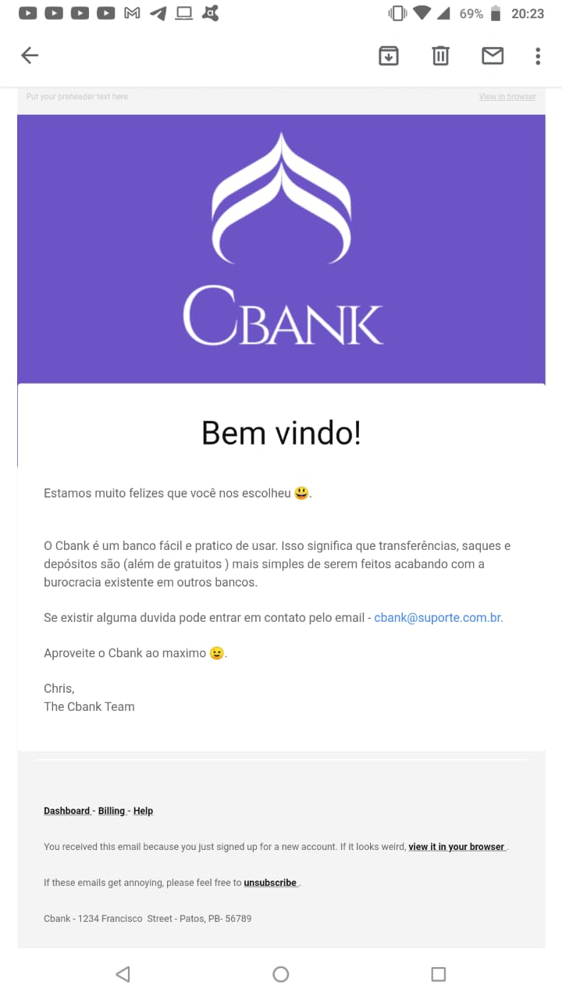

  

    Api developed with python using the starlette.io framework
     
  

## Run project

  
Install dependencies

    <code>poetry shell</code>
     
    <code>poetry install</code>
      
      
  
Create the .env file with your database and key configuration

  <code>database</code>
   
  <code>email and password</code>
   
  <code>hash key</code>
     
     
  
Upgrade database

   <code>alembic upgrade head</code>
      
      
  
Run app

   <code>uvicorn src.app:app --reload</code>
      
      

## Routes in app

- add user
- update user
- login
- transfer
- deposit
- withdrawn

## Feature

- Sending emails when you sign up for the app

  

